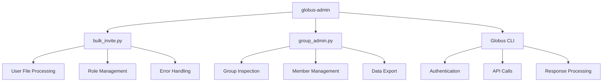

# Administrative Tools Overview

The SIH Globus Toolkit provides several wrapper scripts that simplify common group administration tasks.

## Main Interface

### `globus-admin` - Unified Command Interface

The primary entry point for all administrative operations:

```bash
./scripts/globus-admin <command> [options]
```

**Available Commands:**

| Command | Purpose | Example |
|---------|---------|---------|
| `list` | Show all your groups | `./scripts/globus-admin list` |
| `info` | Display group details | `./scripts/globus-admin info GROUP_ID` |
| `members` | List group members | `./scripts/globus-admin members GROUP_ID` |
| `invite` | Bulk invite users | `./scripts/globus-admin invite GROUP_ID --users-file users.txt` |
| `help` | Show usage information | `./scripts/globus-admin help` |

## Individual Scripts

### 1. Bulk Invite (`bulk_invite.py`)

**Purpose**: Invite multiple users to a Globus group simultaneously.

**Key Features**:
- Read users from file or command line
- Support for different roles (member, manager, admin)
- Dry-run mode for testing
- Identity provisioning
- Detailed error reporting

**Usage Examples**:
```bash
# From file
./scripts/bulk_invite.py GROUP_ID --users-file team.txt --role member

# From command line
./scripts/bulk_invite.py GROUP_ID --users user1@domain.com user2@domain.com --role manager

# With dry run
./scripts/bulk_invite.py GROUP_ID --users-file team.txt --dry-run --verbose
```

### 2. Group Administration (`group_admin.py`)

**Purpose**: Comprehensive group management operations.

**Key Features**:
- List and inspect groups
- Member management
- Data export for backups
- Bulk removal operations

**Usage Examples**:
```bash
# List all groups
./scripts/group_admin.py list

# Export group data
./scripts/group_admin.py export GROUP_ID --output backup.json

# Bulk remove users
./scripts/group_admin.py bulk-remove GROUP_ID --users user1 user2
```

### 3. Demo & Testing (`demo.py`)

**Purpose**: Testing and demonstration of all functionality.

**Features**:
- Login status verification
- Usage examples
- Quick start guidance
- Safe testing without real operations

## Script Architecture



## Common Options

All scripts support these common patterns:

### Input Methods
- **File-based**: `--users-file users.txt`
- **Command-line**: `--users user1 user2 user3`

### Safety Features
- **Dry-run**: `--dry-run` (show what would happen)
- **Verbose**: `--verbose` (detailed output)
- **Validation**: Syntax and permission checking

### Output Formats
- **Human-readable**: Default text output
- **JSON**: `--format json` (where supported)
- **Export**: Structured data files

## Error Handling

The scripts provide comprehensive error handling:

### Authentication Errors
```bash
MissingLoginError: Please run 'globus login'
```

### Permission Errors
```bash
HTTP 403: Insufficient permissions for group operation
```

### User Not Found
```bash
✗ Failed: user@domain.com - Identity not found
```

### Network Issues
```bash
Connection timeout - please check network connectivity
```

## Integration Points

### With Globus CLI
- Uses official Globus CLI commands
- Respects authentication tokens
- Follows CLI output formats

### With External Systems
- File-based user lists
- JSON export for integration
- Exit codes for automation

### With CI/CD
- Script validation
- Automated testing
- Documentation generation

---

**Next Steps:**
- [Bulk Invite Details](bulk-invite.md)
- [Group Management Details](group-admin.md)
- [Demo Script Usage](demo.md)